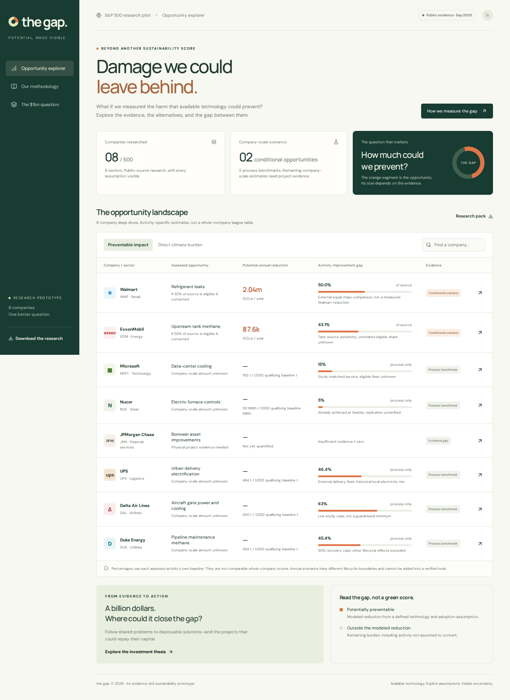

# Sustainability Research Bench

**Start here: [Project context, approach and next steps](PROJECT_CONTEXT.md).** This handoff explains the original goal, decisions, completed work, limitations and how to continue rigorously. AI agents should begin with [AGENTS.md](AGENTS.md).

**[Open the live app](https://preventable-gap-app.vercel.app)** · [Expanded research synthesis](research/expansion/RESEARCH-UPDATE.md) · [App dataset](app/data.json)

Next.js research prototype for a sustainability hackathon. Eight S&P 500 company cases demonstrate an auditable path from reported footprint to available technology to explicitly conditional preventable impact.

## Run

npm ci
npm run dev

## Build and deploy

npm run build
vercel --prod

## Data

`app/data.json` contains sourced inputs, formulas, study boundaries, and missing information. The downloadable research package is at `public/research/research-package.zip`.

Climate damage uses a fixed $255.12/tCO2e factor in 2024 US dollars from Global Value Factors Database V4. These are modeled future societal damages associated with emissions, not observed costs or investment cashflows.

Walmart and Exxon scenarios assume deployment shares; they are not forecasts. Microsoft is a normalized lifecycle process comparison. Nucor is an electricity process case already demonstrated in Seattle, not established remaining fleet opportunity. JPMorgan has insufficient borrower-project data. No valid whole-company preventable-harm ranking across these eight has been established. Direct Scope 1 baselines are separate context and exclude much of some companies' footprints.

Expanded research adds UPS, Delta and Duke; deeper Walmart/Exxon/Microsoft audits; 92 structured evidence records; and downloadable company dossiers. Source measures, external study benchmarks, assumptions, realized improvements and projections remain separate.

## Repository contents

- `app/`: Next.js explorer, company pages, evidence ledgers and scenario controls.
- `research/`: readable research reports, source-linked observations, calculations and archived research scripts.
- `public/research/`: downloadable research package and company dossiers.
- `screenshots/`: desktop and mobile examples.

The web app uses the checked-in dataset and needs no API keys. Research scripts preserve the original investigation; some reference the original local workspace or source archives that are not redistributed. They are not a turnkey research pipeline. Third-party reports are cited by URL; their content remains subject to the original publishers’ terms.

